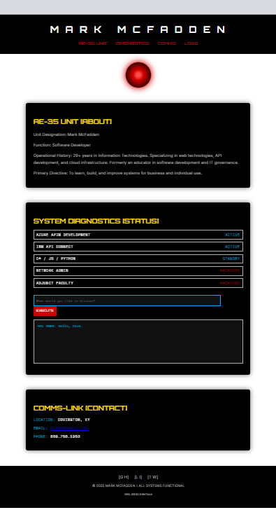

# HAL 9000 Interface



**Unit Designation:** Mark McFadden  
**Function:** Senior Software Developer  
**Location:** Covington, KY  
**Contact:** [m2web@yahoo.com](mailto:m2web@yahoo.com) · 859.750.1953

---

## SYSTEM DIAGNOSTICS

| Diagnostic Label                                       | Status    |
|--------------------------------------------------------|-----------|
| API Gateways (Azure APIM · IBM API Connect)            | ACTIVE    |
| Generative AI (Azure OpenAI · Python · Hugging Face)   | ACTIVE    |
| RAG Pipelines (Embeddings · Retrieval · Evaluation)    | ACTIVE    |
| Full-Stack Development (C# · Java)                     | STANDBY   |
| Network Administration                                 | ARCHIVED  |
| Adjunct Faculty                                        | ARCHIVED  |

---

## CREW MANIFEST [ABOUT]

**Operational History:**  
29+ years in Information Technologies. Experienced in enterprise API development and cloud-native systems,  
with recent work supporting Generative AI initiatives by assisting enterprise data ingestion into Azure using Python.  
Deep expertise in Azure API Management, IBM API Connect, full-stack development (C#/.NET, Java, Python),  
and DevOps pipelines (Azure DevOps YAML, Python Newman test automation).  
Mentor in AI adoption; former adjunct faculty in software development and IT governance.

**Primary Directive:**  
To design, build, and optimize intelligent systems that **combine human insight with AI innovation**,  
delivering secure, resilient, and practical solutions for business and individual use.

---

## COMMS-LINK

- **LOCATION:** Covington, KY
- **EMAIL:** [m2web@yahoo.com](mailto:m2web@yahoo.com)
- **PHONE:** 859.750.1953
- **RESUME:** [Download PDF](documents/M2sAI3ResumeWord.pdf)

---

## Social Links

[GitHub](https://github.com/m2web) |
[LinkedIn](https://www.linkedin.com/in/m2web/)

---

## Example HAL 9000 `SYSTEM DIAGNOSTICS` Interaction

```text
> How are you feeling today?
HAL 9000: I am functioning perfectly. Thank you for asking.
```

Try it here: [HAL 9000 Interaction](https://markmcfadden.net/)

---
