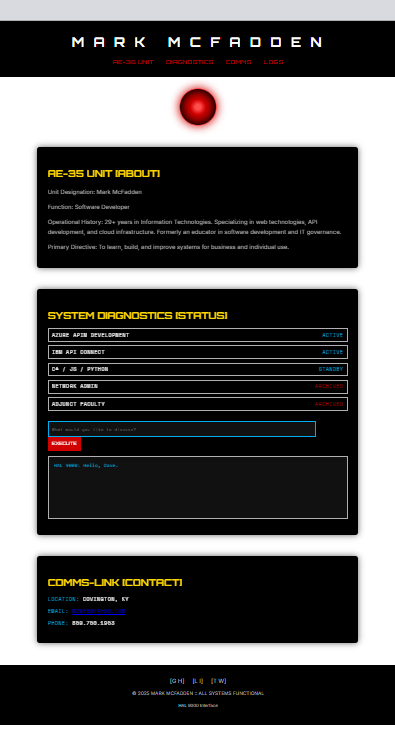

# HAL 9000 Interface



**Unit Designation:** Mark McFadden  
**Function:** AI Developer III  
**Location:** Covington, KY  
**Contact:** [m2web@yahoo.com](mailto:m2web@yahoo.com) · 859.750.1953

---

## SYSTEM DIAGNOSTICS

| Diagnostic Label                                       | Status    |
|--------------------------------------------------------|-----------|
| AI Orchestration (Semantic Kernel · LangGraph)         | ACTIVE    |
| Foundry Operations (Azure AI · GPT-4.1 · Foundry SDKs) | ACTIVE    |
| Enterprise RAG (Proprietary Synthetic Knowledge Systems)| ACTIVE    |
| Intelligent Systems Design (LLMs · Automation)         | ACTIVE    |
| Full-Stack Development (Python · Modern Web Stack)     | ACTIVE    |
| Legacy Languages (C# · Java · VB.NET)                  | ARCHIVED  |
| API Gateways (Azure APIM · IBM API Connect)            | ARCHIVED  |
| Adjunct Faculty                                        | ARCHIVED  |

---

## CREW MANIFEST [ABOUT]

**AI Architecture & Strategic Development:**  
Designing and maintaining sophisticated AI orchestration frameworks using **Semantic Kernel** and **LangGraph** to manage complex, multi-agent workflows. Building scalable, production-ready systems that leverage state-of-the-art LLMs to solve intricate business logic and automation challenges. Scaling an enterprise-wide RAG ecosystem with multiple business-line specific applications—including **Rush Scholar**—to transform internal knowledge into actionable organizational intelligence.

**Foundry Operations & Model Governance:**  
Overseeing the deployment and optimization of models within **Microsoft Foundry** (Azure AI Studio) and **Foundry Tools** (Azure AI Services). Directing the specific implementation of the **gpt-5-mini** model, ensuring that model selection aligns with both performance requirements and operational cost-efficiency.

**Technical Leadership & Systems Governance:**  
Executing leadership and management tasks equivalent to the Systems Manager grade, governing the broader technical infrastructure and ensuring cross-system stability. Defining and enforcing development standards through the **Frontier API** definitions. Managing critical backend integrations including **Formspree** and Hugo-based platforms.

**Primary Directive:**  
To design, build, and optimize intelligent systems that **combine human insight with AI innovation**, delivering secure, resilient, and practical solutions for business and individual use.

---

## COMMS-LINK

- **LOCATION:** Covington, KY
- **EMAIL:** [m2web@yahoo.com](mailto:m2web@yahoo.com)
- **PHONE:** 859.750.1953
- **RESUME:** [Download PDF](documents/M2sAI3ResumeWord.pdf)

---

## Social Links

[GitHub](https://github.com/m2web) |
[LinkedIn](https://www.linkedin.com/in/m2web/)

---

## Example HAL 9000 `SYSTEM DIAGNOSTICS` Interaction

```text
> How are you feeling today?
HAL 9000: I am functioning perfectly. Thank you for asking.
```

Try it here: [HAL 9000 Interaction](https://markmcfadden.net/)

---
