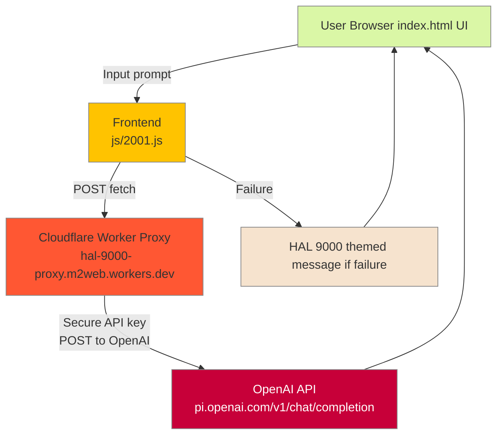

```mermaid

flowchart TD
    A[User Browser index.html UI]:::user
    B[Frontend<br>js/2001.js]:::frontend
    C[Cloudflare Worker Proxy<br> hal-9000-proxy.m2web.workers.dev]:::proxy
    D[OpenAI API<br>pi.openai.com/v1/chat/completion]:::openai
    E[HAL 9000 themed message if failure]:::error

    A -->|Input prompt| B
    B -->|POST fetch| C
    C -->|Secure API key<br>POST to OpenAI| D
    D --> A
    B -- Failure --> E
    E --> A

    classDef user fill:#DAF7A6,stroke:#888;
    classDef frontend fill:#FFC300,stroke:#888;
    classDef proxy fill:#FF5733,stroke:#888;
    classDef openai fill:#C70039,stroke:#888,color:#fff;
    classDef display fill:#D6EAF8,stroke:#888;
    classDef error fill:#F6E3CE,stroke:#888;
```
